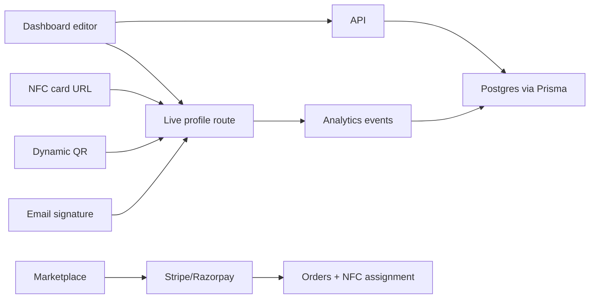

# tapyfi Architecture

## Major systems

1. Public website and landing experience
2. Authenticated identity dashboard
3. Live dynamic profile engine
4. NFC, QR, and email signature infrastructure
5. NFC e-commerce marketplace

## Frontend

The Vite app uses React, TypeScript, Tailwind CSS, Framer Motion, Lucide icons, QR generation, drag-and-drop link ordering, a PWA shell, and route-level transitions.

## Backend

The Express server provides route contracts for auth, profiles, NFC assignment, QR generation, analytics ingestion, commerce checkout, and admin operations. Prisma models define the production persistence layer.

## Data flow

## NFC principle

NFC tags store the dynamic URL only. The recommended chip URL is the immutable profile ID route, for example `/p/{profileId}`. Vanity URLs like `/profile/faraz` can change, but the NFC-safe ID route keeps resolving to the same saved database profile. Profile content, links, images, QR, and signatures are loaded from the saved profile record at request time, so updates are live after refresh.
